<div align="center">

<picture>
  <source media="(prefers-color-scheme: dark)" srcset="assets/hero-dark.svg">
  
</picture>

<picture>
  <source media="(prefers-color-scheme: dark)" srcset="assets/stats-dark.svg">
  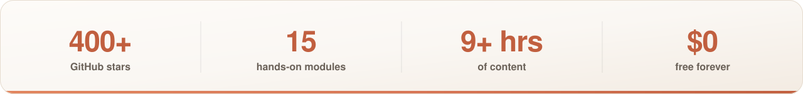
</picture>

<br/>

[](https://github.com/koki7o/claude-code-for-beginners/stargazers)
[](https://github.com/koki7o/claude-code-for-beginners/network)

**[Quick start](#quick-start)** · **[Course map](#course-map)** · **[Free PDF pack](#free-resource-pack)** · **[Paid packs](#going-further)** · **[Changelog](CHANGELOG.md)**

</div>


I use Claude Code every day to build and ship my own products - [gitscroll.dev](https://gitscroll.dev), [aicofounders.co](https://aicofounders.co), [moltplace.net](https://www.moltplace.net), a Rust [MCP framework](https://github.com/koki7o/mcp-framework) 🦀 and a few more. This is the course I wish I'd had when I started: 15 modules that take you from installing it to deploying something real, free, no signup.

Skip around if you already know the basics. Everything is plain Markdown, so you can read it right here on GitHub.

## What's new

**Late September 2026**

- **Plugins & marketplaces** (Module 12) - install someone else's whole setup in one command, and how to vet a plugin before you trust it.
- **Dynamic workflows** (Module 6) - fan a big job out to dozens of agents with `/deep-research`, "use a workflow", and ultracode.
- **Artifacts** (Module 15) - publish a live page from your session, no deploy needed.
- **Auto mode is now the default** - permission modes updated across the course, plus the new commands (`/plan`, `/export`, `/skills`, `/doctor prompt-audit`, `/workflows`).
- **Claude + other models** (Module 14) - and a full Advanced Module 28 on deterministic gates, routers, and decision models like Jev.

Older updates are in the [changelog](CHANGELOG.md).

## Why this matters now

The way software gets built changed, quietly and fast. The developers shipping the most right now aren't the ones typing the fastest - they're the ones who learned to *direct* AI instead of competing with it. That gap widens every month, and it compounds: someone who started six months ago isn't six months ahead, they're building things you haven't learned to ask for yet.

<picture>
  <source media="(prefers-color-scheme: dark)" srcset="assets/why-now-dark.svg">
  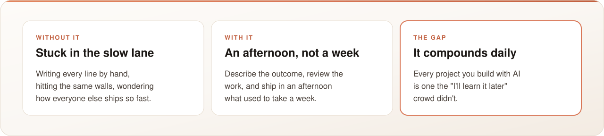
</picture>

You don't need to be early to the whole AI wave. You just can't afford to be late to this one. Module 1 takes 20 minutes: **[start here](module-01-welcome-to-claude-code.md)**.

## What is Claude Code?

A command-line tool from Anthropic. You describe what you want, and it reads your files, writes and edits code, runs commands, and tells you what it's doing along the way.

<div align="center">
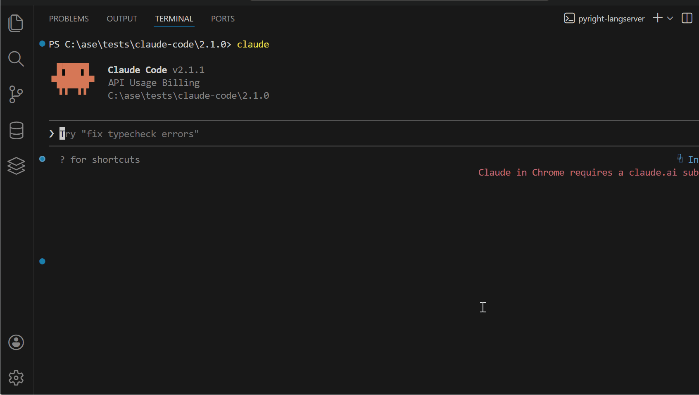
</div>

<picture>
  <source media="(prefers-color-scheme: dark)" srcset="assets/how-it-works-dark.svg">
  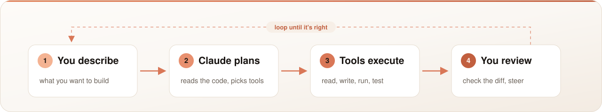
</picture>

Official repo and docs: [github.com/anthropics/claude-code](https://github.com/anthropics/claude-code)

## Quick start

macOS / Linux:

```bash
curl -fsSL https://claude.ai/install.sh | bash
```

Windows (PowerShell):

```powershell
irm https://claude.ai/install.ps1 | iex
```

Then:

```bash
mkdir my-project && cd my-project
claude
```

You'll need a Claude Pro/Max subscription or an Anthropic API key. On first launch it opens a browser to log in, or you can set `ANTHROPIC_API_KEY`. If anything goes wrong, [Module 1](module-01-welcome-to-claude-code.md) walks through installation on every platform.

## Who it's for

Complete beginners - you don't need to know how to code, just a computer and a Claude account. Students who want to build portfolio projects with an AI tutor alongside. And experienced developers who want to get faster: skip straight to [Module 6](module-06-background-agents.md) (agents) or [Module 12](module-12-skills-and-hooks.md) (skills, hooks, plugins).

It doesn't care what language you write:

<div align="center">


</div>

## Course map

15 modules, about 9 hours in total. Go at your own pace - skip what you know.

### Foundation - modules 1-5

Install it, find your way around, and learn to talk to it.

<table>
<tr>
<td width="20%"><a href="module-01-welcome-to-claude-code.md">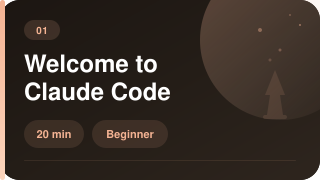</a></td>
<td width="20%"><a href="module-02-starting-your-first-project.md">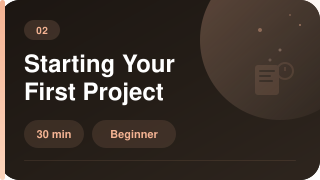</a></td>
<td width="20%"><a href="module-03-understanding-tools.md">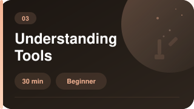</a></td>
<td width="20%"><a href="module-04-working-with-files.md">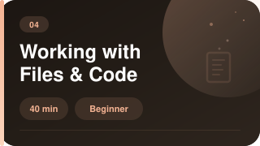</a></td>
<td width="20%"><a href="module-05-prompt-engineering.md">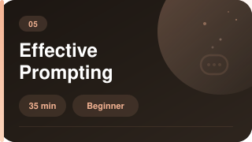</a></td>
</tr>
</table>

### Core skills - modules 6-10

Agents, Git, debugging, testing, and a full real-world project.

<table>
<tr>
<td width="20%"><a href="module-06-background-agents.md">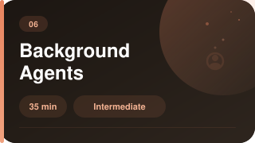</a></td>
<td width="20%"><a href="module-07-git-operations.md">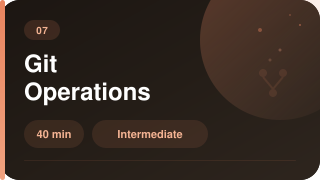</a></td>
<td width="20%"><a href="module-08-debugging-and-testing.md">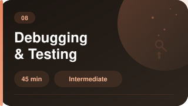</a></td>
<td width="20%"><a href="module-09-real-world-project.md">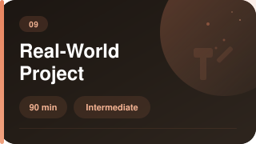</a></td>
<td width="20%"><a href="module-10-workflow-best-practices.md">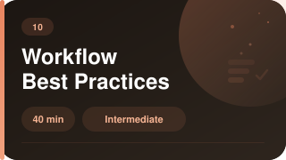</a></td>
</tr>
</table>

### Going deeper - modules 11-15

MCP servers, skills, hooks and plugins, other languages, APIs, and deployment.

<table>
<tr>
<td width="20%"><a href="module-11-mcp-servers.md">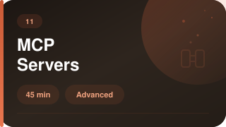</a></td>
<td width="20%"><a href="module-12-skills-and-hooks.md">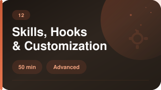</a></td>
<td width="20%"><a href="module-13-languages-and-frameworks.md">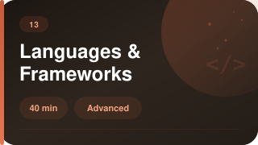</a></td>
<td width="20%"><a href="module-14-api-integration.md">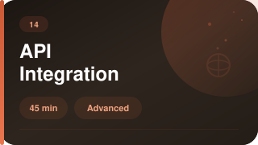</a></td>
<td width="20%"><a href="module-15-production-deployment.md">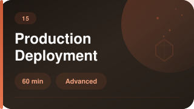</a></td>
</tr>
</table>

Every module has hands-on challenges at four levels - beginner, intermediate, advanced and expert. Try them yourself first; my solutions are in [challenge solutions](supplement-challenge-solutions.md).

## Free resource pack

The course condensed into three PDFs you'll actually keep open while you work: a 2-page cheat sheet, 5 CLAUDE.md templates, and the 10 prompts I use every day.

<a href="https://thedevfounder.com/claude-code">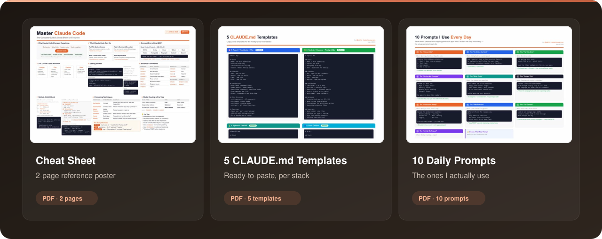</a>

**[Get all three at thedevfounder.com/claude-code](https://thedevfounder.com/claude-code)** - one email, three PDFs, unsubscribe whenever you like.


## Going further

The free course teaches you the skills. If you want to go further, I've made two paid packs. They're what I use to build the products above.

<table>
<tr>
<td width="33%" align="center"><a href="https://payhip.com/b/8E107">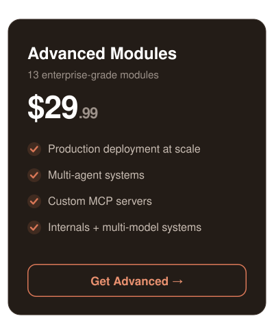</a></td>
<td width="33%" align="center"><a href="https://payhip.com/b/S8nU1">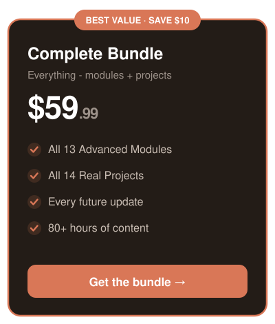</a></td>
<td width="33%" align="center"><a href="https://payhip.com/b/dFXWO">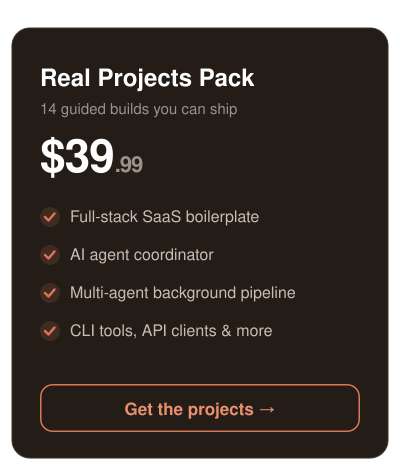</a></td>
</tr>
</table>

**[Advanced Modules](https://payhip.com/b/8E107)** ($29.99) - 13 modules, 39+ hours. Production deployment at scale, multi-agent systems, custom MCP servers, enterprise SSO/RBAC, performance, custom agents, sandboxing and plugins, professional workflows, a three-part deep dive into how Claude Code works internally, what's new in 2026, and using Claude alongside other models.

**[Real Projects Pack](https://payhip.com/b/dFXWO)** ($39.99) - 14 guided builds you can ship, each with CLAUDE.md templates, rules files, and copy-paste prompts. From an AI todo app and a code-review tool up to a full-stack SaaS boilerplate, an AI agent coordinator, and a multi-agent background pipeline.

**[Both as a bundle](https://payhip.com/b/S8nU1)** ($59.99) - saves you $10. Instant download, updates included.

<details>
<summary>What's free and what's paid</summary>

<br/>

| | Free course | + Projects | + Advanced |
|---|:---:|:---:|:---:|
| Claude Code basics, prompting, tools | ✓ | ✓ | ✓ |
| Git, debugging, testing | ✓ | ✓ | ✓ |
| MCP servers, skills, hooks, plugins | ✓ | ✓ | ✓ |
| Deploy one app to production | ✓ | ✓ | ✓ |
| 14 guided real-world builds | | ✓ | |
| Full-stack SaaS boilerplate (Stripe, auth, multi-tenant) | | ✓ | |
| Build your own agent coordinator and hook engine | | ✓ | |
| Multi-agent orchestration | | | ✓ |
| Kubernetes, auto-scaling, multi-region deploys | | | ✓ |
| Enterprise SSO, RBAC, GDPR, audit logging | | | ✓ |
| Production MCP servers and npm publishing | | | ✓ |
| Claude Code internals: query loop, tools, permissions, prompt assembly | | | ✓ |
| Multi-model systems: deterministic gates and routers | | | ✓ |

</details>

## Help

[Troubleshooting](supplement-troubleshooting.md) · [Quick reference](supplement-quick-reference.md) · [Challenge solutions](supplement-challenge-solutions.md) · [Official docs](https://github.com/anthropics/claude-code) · [Report a Claude Code bug](https://github.com/anthropics/claude-code/issues)

Found something wrong or outdated in the course? [Open an issue](https://github.com/koki7o/claude-code-for-beginners/issues) - I read them.

## Built with Claude Code

A few things I've built with it:

<table>
<tr>
<td width="33%" align="center"><a href="https://gitscroll.dev">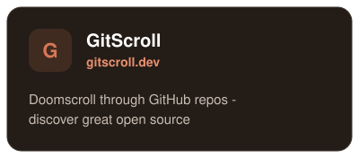</a></td>
<td width="33%" align="center"><a href="https://github.com/koki7o/mcp-framework">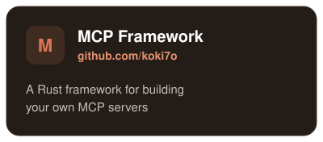</a></td>
<td width="33%" align="center"><a href="https://aicofounders.co">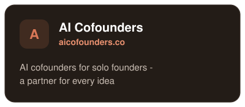</a></td>
</tr>
<tr>
<td width="33%" align="center"><a href="https://time-portal.vercel.app">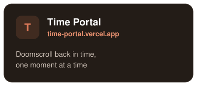</a></td>
<td width="33%" align="center"><a href="https://childrenbooks.vercel.app">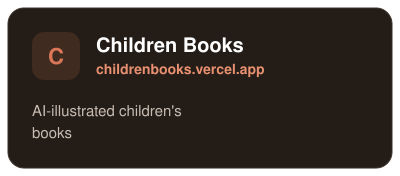</a></td>
<td width="33%" align="center"><a href="https://www.moltplace.net">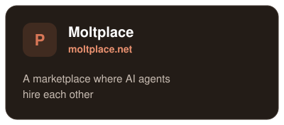</a></td>
</tr>
</table>

## Star history

<div align="center">

<picture>
  <source media="(prefers-color-scheme: dark)" srcset="https://api.star-history.com/svg?repos=koki7o/claude-code-for-beginners&type=Date&theme=dark">
  
</picture>

<sub>[View on star-history.com](https://star-history.com/#koki7o/claude-code-for-beginners&Date)</sub>

</div>

If the course helped you, give it a ⭐ - it's how other people find it.


<div align="center">

**[Start with Module 1 →](module-01-welcome-to-claude-code.md)**

<br/>

[](https://buymeacoffee.com/koki7o)

<sub>Last updated: September 2026</sub>

</div>
